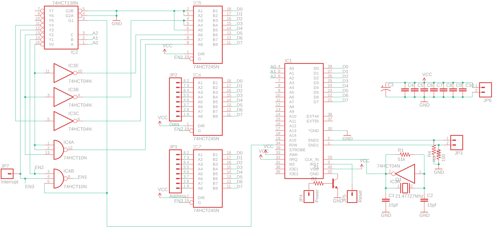
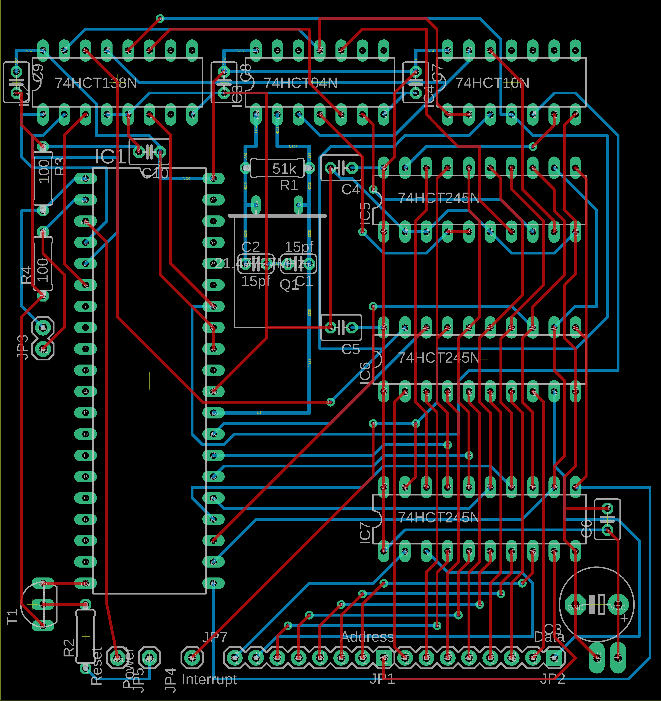
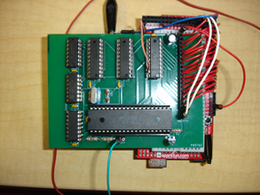
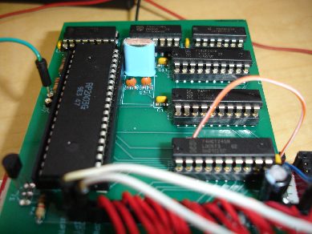

# standalone-nes-synth
A helpful dev board for creating NES synth interfaces

A huge thanks to kevtris https://www.youtube.com/channel/UCOkbec10-yP76r-NXibyMew for all the help figuring out how to keep the NES in an infinite loop! Wouldn't have gotten anywhere without that tip :)

This board gives you an easy way to abstract the necessary hardware for driving an NES CPU from your interface application. The NES CPU is kept in an infinite loop, with note data shifted in through the shift registers.

